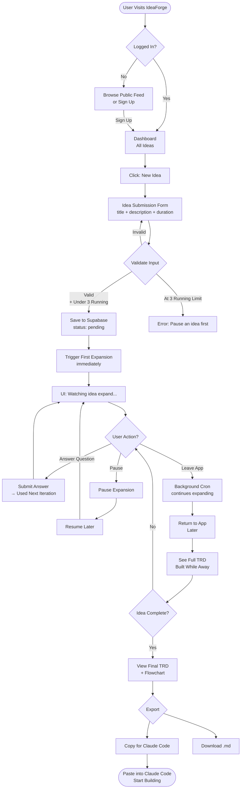
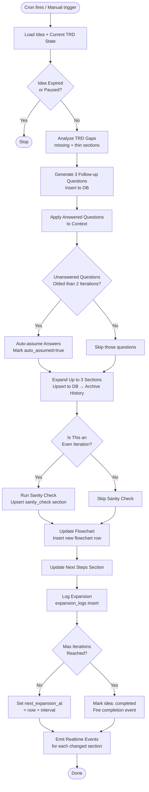
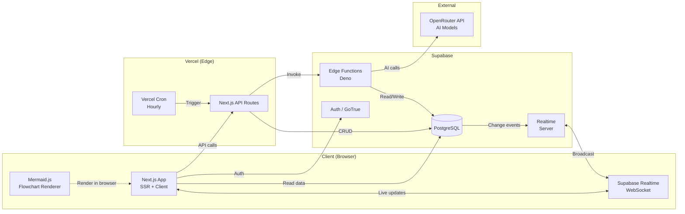
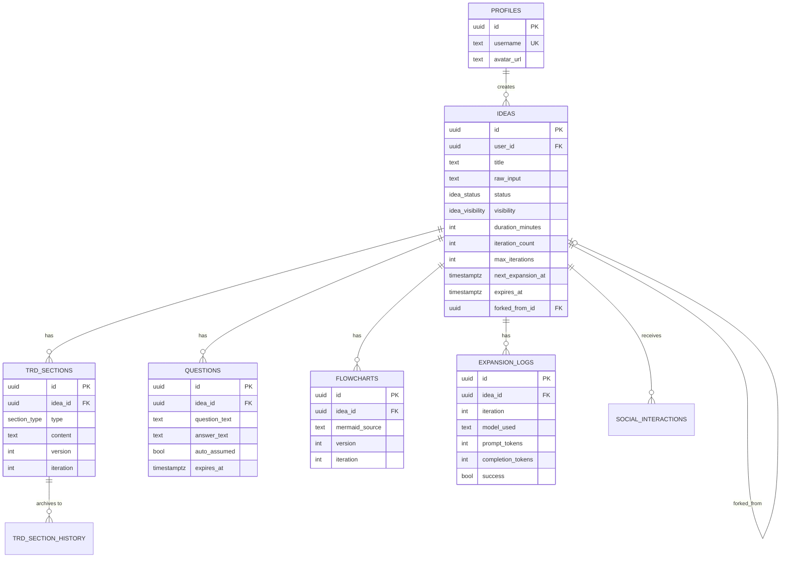

# IdeaForge — Technical Requirements Document

**Working Title:** IdeaForge  
**Version:** 1.0  
**Status:** Draft  
**Date:** 2026-06-22  
**Author:** Claude Code (on behalf of naterjlevy)

---

## Table of Contents

1. [Project Vision](#1-project-vision)
2. [Problem Statement](#2-problem-statement)
3. [Target Users & Personas](#3-target-users--personas)
4. [Feature Requirements](#4-feature-requirements)
5. [User Stories](#5-user-stories)
6. [System Architecture](#6-system-architecture)
7. [Database Schema](#7-database-schema)
8. [API Design](#8-api-design)
9. [AI Expansion Engine](#9-ai-expansion-engine)
10. [Real-Time & Background Processing](#10-real-time--background-processing)
11. [Authentication & Authorization](#11-authentication--authorization)
12. [Social Features](#12-social-features)
13. [Export System](#13-export-system)
14. [Security Requirements](#14-security-requirements)
15. [Performance & Scalability](#15-performance--scalability)
16. [Error Handling & Edge Cases](#16-error-handling--edge-cases)
17. [Testing Strategy](#17-testing-strategy)
18. [Deployment Architecture](#18-deployment-architecture)
19. [Cost Analysis](#19-cost-analysis)
20. [Development Roadmap](#20-development-roadmap)
21. [Sanity Checks](#21-sanity-checks)
22. [Open Questions & Assumptions](#22-open-questions--assumptions)
23. [System Flowcharts](#23-system-flowcharts)

---

## 1. Project Vision

IdeaForge is a web application that takes raw, unpolished app ideas and autonomously expands them into comprehensive Technical Requirements Documents (TRDs), architecture diagrams, flowchart trees, and actionable next steps — all while the user is away from the app.

Users drop in a seed idea ("an app that tracks your Invisalign"), set a run duration (1h, 3h, 20h), and the AI engine begins iteratively expanding, questioning, sanity-checking, and building out the idea in the background. When they return, they have a production-ready TRD they can paste directly into Claude Code to start building.

**Tagline:** *Drop an idea. Come back to a plan.*

**Core Differentiator:**  
Unlike ChatGPT or Claude where you stay in the conversation, IdeaForge runs autonomously in the background on a server — you set it and forget it. The longer it runs, the richer the output. Multiple ideas can incubate simultaneously.

---

## 2. Problem Statement

### The Gap

Developers and entrepreneurs have more ideas than time. When inspiration strikes, the typical path is:
1. Write the idea in Notes
2. Forget it, or
3. Try to flesh it out in a chat conversation — losing the thread when the session ends

There is no tool that autonomously expands an idea into a full technical plan while you go about your day.

### Current Pain Points

| Pain Point | Impact |
|---|---|
| Ideas die in Notes apps | Ideas never get actionable |
| ChatGPT sessions are ephemeral | Context lost, have to restart |
| Manual TRD writing is slow | Takes 8-20 hours for a thorough doc |
| Hard to see the big picture | Individual conversations miss the forest for the trees |
| No way to share idea exploration | Collaboration is awkward |

### The Opportunity

If an AI agent could run autonomously — asking clarifying questions, building structure, catching contradictions, generating diagrams — and deliver a finished artifact, the gap between "I have an idea" and "I'm ready to start building" collapses from days/weeks to hours.

---

## 3. Target Users & Personas

### Primary: The Solo Builder (Indie Developer / Hacker)
- Has 5-10 app ideas in their Notes at any time
- Technically literate — understands what a TRD is
- Wants to ship fast but needs structure first
- Uses Claude Code, Cursor, or similar AI dev tools
- **Goal:** Get from idea to buildable spec with minimal effort

### Secondary: The Startup Founder / Non-Technical Entrepreneur
- Has product ideas but struggles to articulate them technically
- Needs help turning "I want an app that does X" into something a developer can execute on
- Values the follow-up questions as much as the output
- **Goal:** Have a document they can hand to a developer or agency

### Tertiary: The Idea Explorer / Hobbyist
- Browses the public feed to see what others are building
- Forks ideas they find interesting and adapts them
- May not ship anything but values the ideation process
- **Goal:** Discovery and inspiration

### Anti-Persona (Out of Scope)
- Large enterprises needing formal JIRA-integrated specs
- Teams needing collaborative real-time editing (this is a single-user tool per idea)
- Users needing private/confidential IP protection at enterprise level (wrong tier)

---

## 4. Feature Requirements

### 4.1 MVP Features (Phase 1 + 2)

#### Core Idea Management
- [ ] Submit an idea with a title and raw description (min 20 chars, max 2000 chars)
- [ ] Set run duration: 1h / 3h / 6h / 12h / 20h / custom
- [ ] Set visibility: public or private (default private)
- [ ] View list of all your ideas with status indicators
- [ ] Pause and resume an active expansion
- [ ] Delete an idea (soft delete with 30-day recovery)

#### AI Expansion Engine
- [ ] Iterative AI expansion loop runs every 30 minutes (configurable)
- [ ] Generates and displays follow-up questions each iteration
- [ ] User can answer questions to guide expansion (optional — AI auto-assumes if unanswered within 2 iterations)
- [ ] TRD built section by section across iterations
- [ ] Mermaid.js flowchart generated and updated each iteration
- [ ] Sanity check runs every other iteration (flags contradictions, scope issues)
- [ ] Progress bar showing iteration count and time remaining

#### TRD Sections Generated
- Problem Statement
- Target Users
- Feature List (MVP vs V2+)
- User Stories
- System Architecture
- Data Model
- API Design
- Security Considerations
- Deployment Approach
- Open Questions
- Next Steps (immediate actions)

#### Display
- [ ] Real-time updates when expansion loop completes (Supabase Realtime)
- [ ] View each TRD section individually or as full document
- [ ] View flowchart rendered in browser (Mermaid.js)
- [ ] View expansion timeline (what changed each iteration)
- [ ] View all follow-up questions and answers/assumptions

#### Export
- [ ] Copy full TRD as markdown to clipboard
- [ ] Download as `.md` file
- [ ] "Claude Code Ready" export — prefixed prompt optimized for pasting into Claude Code

### 4.2 V2 Features (Phase 3+)

#### Social Features
- [ ] Browse public feed — all public ideas sorted by recency, popularity, or category
- [ ] Like an idea
- [ ] Fork an idea — copies seed idea and starts a new expansion
- [ ] Share link per idea (public ideas only)
- [ ] User profile page with their public ideas
- [ ] Trending ideas section

#### Enhanced AI
- [ ] Choose AI model (free vs paid OpenRouter models)
- [ ] "Deep mode" — more frequent iterations, more aggressive expansion
- [ ] Compare two expansion runs of the same idea (A/B)
- [ ] Ask the AI follow-up questions directly in a chat interface

#### Export V2
- [ ] Export as PDF
- [ ] Export as structured JSON (for programmatic use)
- [ ] GitHub Gist integration — push TRD directly to a Gist

### 4.3 Out of Scope (V1)
- Mobile native app (web is responsive, no native app)
- Team collaboration / multi-user editing
- Direct integration with Claude Code CLI
- Stripe billing / paid tiers (V1 is free)
- Domain-specific templates (legal, medical, etc.)

---

## 5. User Stories

### Authentication

> **US-001:** As a new user, I want to sign up with email/Google so I can save my ideas.

> **US-002:** As a returning user, I want to log in and see all my ideas where I left them.

### Idea Submission

> **US-003:** As a user, I want to type my raw idea in plain English and hit "Forge" to start the expansion, so I don't have to format anything upfront.

> **US-004:** As a user, I want to choose how long the AI should work on my idea (1h–20h) so I can control depth vs. speed.

> **US-005:** As a user, I want to set my idea as private by default so my IP isn't exposed before I'm ready.

### Watching It Grow

> **US-006:** As a user, I want to open the app on my phone hours later and see the TRD has been building in my absence.

> **US-007:** As a user, I want to see exactly what changed in each iteration, so I can trace the AI's reasoning.

> **US-008:** As a user, I want to be asked follow-up questions so I can steer the expansion, but I don't want to be blocked if I don't answer.

> **US-009:** As a user, I want to see a visual flowchart of the architecture that updates as the idea grows.

### Export

> **US-010:** As a user, I want a single "Copy for Claude Code" button that gives me a perfectly formatted prompt with the full TRD.

> **US-011:** As a user, I want to download my TRD as a markdown file so I can version-control it.

### Social

> **US-012:** As a user, I want to browse other people's public ideas to see what's being ideated.

> **US-013:** As a user, I want to fork an idea I find interesting and start my own expansion from that seed.

> **US-014:** As a user, I want to share a link to my idea so I can get feedback from others.

### Multiple Ideas

> **US-015:** As a user, I want 3 ideas running simultaneously so I can explore multiple directions at once.

> **US-016:** As a user, I want a dashboard that shows all my active ideas with their current status and progress.

---

## 6. System Architecture

### 6.1 Architecture Overview

```
┌─────────────────────────────────────────────────────────────┐
│                        CLIENT LAYER                          │
│  Next.js 14 (App Router) + TypeScript + Tailwind + shadcn   │
│  - Server Components for initial page load                   │
│  - Client Components for real-time updates                   │
│  - Supabase JS client for DB reads                          │
│  - Mermaid.js for flowchart rendering                       │
└───────────────────────────┬────────────────────────────────┘
                            │ HTTPS + WebSocket
┌───────────────────────────▼────────────────────────────────┐
│                      SUPABASE LAYER                          │
│                                                              │
│  ┌──────────────┐  ┌──────────────┐  ┌──────────────────┐  │
│  │  PostgreSQL  │  │ Edge Functions│  │    Realtime      │  │
│  │  (main DB)   │  │  (Deno)      │  │  (WebSocket)     │  │
│  └──────┬───────┘  └──────┬───────┘  └──────────────────┘  │
│         │                 │                                   │
│  ┌──────▼───────┐  ┌──────▼───────┐                         │
│  │  Row Level   │  │  Auth (JWT)  │                         │
│  │  Security    │  │  + GoTrue    │                         │
│  └──────────────┘  └──────────────┘                         │
└───────────────────────────┬────────────────────────────────┘
                            │
┌───────────────────────────▼────────────────────────────────┐
│                   BACKGROUND SCHEDULER                       │
│  Vercel Cron Jobs (Hobby: free, 2 jobs max)                 │
│  → Calls /api/cron/expand every 30 minutes                  │
│  → API route queries Supabase for due expansions            │
│  → Calls expand-idea Edge Function per idea                 │
└───────────────────────────┬────────────────────────────────┘
                            │
┌───────────────────────────▼────────────────────────────────┐
│                      AI LAYER                                │
│  OpenRouter API                                             │
│  - Default model: deepseek/deepseek-r1:free                 │
│  - Fallback: meta-llama/llama-3.3-70b-instruct:free         │
│  - Paid option: anthropic/claude-3.5-sonnet                 │
└─────────────────────────────────────────────────────────────┘
```

### 6.2 Technology Stack

| Layer | Technology | Justification |
|---|---|---|
| Frontend | Next.js 14 (App Router) | SSR for SEO on public feed, RSC for performance |
| Language | TypeScript | Type safety across full stack |
| Styling | Tailwind CSS + shadcn/ui | Fast development, accessible components |
| Database | Supabase (PostgreSQL) | Free tier, built-in auth, realtime, RLS |
| Auth | Supabase Auth | Google OAuth + email/magic link, free |
| Background Jobs | Vercel Cron | Free on Hobby, no extra service needed |
| AI | OpenRouter | Model-agnostic, free models available |
| Flowcharts | Mermaid.js | Open source, renders in browser, no backend needed |
| Deployment | Vercel | Free Hobby tier, Next.js native, cron support |
| File Storage | Supabase Storage | For PDF exports (V2) |

### 6.3 Why Vercel Cron Over pg_cron

Supabase pg_cron is only available on the Pro plan ($25/month). Vercel Cron Jobs are free on the Hobby plan and call a Next.js API route on a schedule. This API route queries Supabase for ideas that have a scheduled expansion due and fires the expansion Edge Function. This is zero-cost and achieves the same result.

**Tradeoff:** Vercel Hobby plan limits cron frequency to daily. For 30-minute expansions, we use the Vercel Hobby cron to call a self-scheduling mechanism:
- Idea is submitted → creates a record with `next_expansion_at = now() + 30 minutes`
- Cron runs every hour, finds all ideas where `next_expansion_at <= now()` and fires them
- Expansion completes → updates `next_expansion_at = now() + interval`

**Alternative if more frequent scheduling is needed:** Upstash QStash (free tier: 500 messages/day, supports scheduled HTTP calls). At max 3 concurrent ideas with 30-minute intervals = 144 calls/day — within free limit.

### 6.4 Data Flow: Idea Submission to First Expansion

```
User submits idea
    │
    ▼
Next.js API route (/api/ideas)
    │
    ├── Validates input (length, auth)
    │
    ├── Inserts idea record in Supabase
    │       status: 'pending'
    │       next_expansion_at: now()
    │
    ├── Immediately calls Edge Function: expand-idea
    │       (first expansion runs instantly, not waiting for cron)
    │
    └── Returns idea ID to client
            │
            ▼
        Client subscribes to Supabase Realtime channel for this idea_id
        → UI updates in real-time as sections are written
```

---

## 7. Database Schema

All tables use UUID primary keys. All timestamps are `TIMESTAMPTZ` in UTC. Row Level Security (RLS) is enabled on all tables.

### 7.1 Schema Definitions

```sql
-- ─────────────────────────────────────────────
-- PROFILES (extends Supabase auth.users)
-- ─────────────────────────────────────────────
CREATE TABLE profiles (
  id          UUID PRIMARY KEY REFERENCES auth.users(id) ON DELETE CASCADE,
  username    TEXT UNIQUE NOT NULL,
  avatar_url  TEXT,
  bio         TEXT,
  created_at  TIMESTAMPTZ DEFAULT NOW()
);

-- Auto-create profile on signup
CREATE OR REPLACE FUNCTION handle_new_user()
RETURNS TRIGGER LANGUAGE plpgsql SECURITY DEFINER AS $$
BEGIN
  INSERT INTO profiles (id, username)
  VALUES (NEW.id, SPLIT_PART(NEW.email, '@', 1) || '_' || SUBSTR(NEW.id::TEXT, 1, 4));
  RETURN NEW;
END;
$$;
CREATE TRIGGER on_auth_user_created
  AFTER INSERT ON auth.users
  FOR EACH ROW EXECUTE FUNCTION handle_new_user();


-- ─────────────────────────────────────────────
-- IDEAS (the core entity)
-- ─────────────────────────────────────────────
CREATE TYPE idea_status AS ENUM ('pending', 'running', 'paused', 'completed', 'failed');
CREATE TYPE idea_visibility AS ENUM ('public', 'private');

CREATE TABLE ideas (
  id                       UUID PRIMARY KEY DEFAULT gen_random_uuid(),
  user_id                  UUID NOT NULL REFERENCES auth.users(id) ON DELETE CASCADE,
  title                    TEXT NOT NULL CHECK (LENGTH(title) BETWEEN 3 AND 120),
  raw_input                TEXT NOT NULL CHECK (LENGTH(raw_input) BETWEEN 20 AND 2000),
  status                   idea_status DEFAULT 'pending',
  visibility               idea_visibility DEFAULT 'private',
  duration_minutes         INTEGER NOT NULL CHECK (duration_minutes BETWEEN 60 AND 1440),
  iteration_count          INTEGER DEFAULT 0,
  max_iterations           INTEGER NOT NULL,
  iteration_interval_min   INTEGER DEFAULT 30,
  next_expansion_at        TIMESTAMPTZ,
  started_at               TIMESTAMPTZ,
  expires_at               TIMESTAMPTZ,
  completed_at             TIMESTAMPTZ,
  paused_at                TIMESTAMPTZ,
  view_count               INTEGER DEFAULT 0,
  fork_count               INTEGER DEFAULT 0,
  like_count               INTEGER DEFAULT 0,
  forked_from_id           UUID REFERENCES ideas(id),
  created_at               TIMESTAMPTZ DEFAULT NOW(),
  updated_at               TIMESTAMPTZ DEFAULT NOW(),
  deleted_at               TIMESTAMPTZ  -- soft delete
);

-- Computed: max_iterations = FLOOR(duration_minutes / iteration_interval_min)
-- Example: 3h / 30min = 6 iterations

CREATE INDEX ideas_user_id_idx ON ideas(user_id);
CREATE INDEX ideas_status_next_expansion_idx ON ideas(status, next_expansion_at)
  WHERE deleted_at IS NULL;
CREATE INDEX ideas_visibility_idx ON ideas(visibility, created_at DESC)
  WHERE deleted_at IS NULL AND status != 'failed';


-- ─────────────────────────────────────────────
-- TRD SECTIONS (the expanding content)
-- ─────────────────────────────────────────────
CREATE TYPE section_type AS ENUM (
  'executive_summary',
  'problem_statement',
  'target_users',
  'features_mvp',
  'features_v2',
  'user_stories',
  'system_architecture',
  'data_model',
  'api_design',
  'security',
  'performance',
  'error_handling',
  'deployment',
  'testing',
  'roadmap',
  'open_questions',
  'sanity_check',
  'next_steps'
);

CREATE TABLE trd_sections (
  id          UUID PRIMARY KEY DEFAULT gen_random_uuid(),
  idea_id     UUID NOT NULL REFERENCES ideas(id) ON DELETE CASCADE,
  type        section_type NOT NULL,
  content     TEXT NOT NULL,
  version     INTEGER NOT NULL DEFAULT 1,
  iteration   INTEGER NOT NULL,
  word_count  INTEGER GENERATED ALWAYS AS (
    ARRAY_LENGTH(REGEXP_SPLIT_TO_ARRAY(TRIM(content), '\s+'), 1)
  ) STORED,
  created_at  TIMESTAMPTZ DEFAULT NOW(),
  updated_at  TIMESTAMPTZ DEFAULT NOW(),
  UNIQUE(idea_id, type)  -- one row per section per idea, updated in place
);

CREATE INDEX trd_sections_idea_id_idx ON trd_sections(idea_id);


-- ─────────────────────────────────────────────
-- TRD SECTION HISTORY (audit trail per version)
-- ─────────────────────────────────────────────
CREATE TABLE trd_section_history (
  id          UUID PRIMARY KEY DEFAULT gen_random_uuid(),
  section_id  UUID NOT NULL REFERENCES trd_sections(id) ON DELETE CASCADE,
  idea_id     UUID NOT NULL,
  type        section_type NOT NULL,
  content     TEXT NOT NULL,
  version     INTEGER NOT NULL,
  iteration   INTEGER NOT NULL,
  created_at  TIMESTAMPTZ DEFAULT NOW()
);

-- Trigger: copy to history before update
CREATE OR REPLACE FUNCTION archive_trd_section()
RETURNS TRIGGER LANGUAGE plpgsql AS $$
BEGIN
  INSERT INTO trd_section_history (section_id, idea_id, type, content, version, iteration)
  VALUES (OLD.id, OLD.idea_id, OLD.type, OLD.content, OLD.version, OLD.iteration);
  RETURN NEW;
END;
$$;
CREATE TRIGGER on_trd_section_update
  BEFORE UPDATE ON trd_sections
  FOR EACH ROW WHEN (OLD.content IS DISTINCT FROM NEW.content)
  EXECUTE FUNCTION archive_trd_section();


-- ─────────────────────────────────────────────
-- FLOWCHARTS (Mermaid source, versioned)
-- ─────────────────────────────────────────────
CREATE TABLE flowcharts (
  id             UUID PRIMARY KEY DEFAULT gen_random_uuid(),
  idea_id        UUID NOT NULL REFERENCES ideas(id) ON DELETE CASCADE,
  mermaid_source TEXT NOT NULL,
  version        INTEGER NOT NULL DEFAULT 1,
  iteration      INTEGER NOT NULL,
  created_at     TIMESTAMPTZ DEFAULT NOW()
);
-- Always INSERT new rows — keep full history. Latest = MAX(version)
CREATE INDEX flowcharts_idea_id_version_idx ON flowcharts(idea_id, version DESC);


-- ─────────────────────────────────────────────
-- QUESTIONS (follow-up clarifications)
-- ─────────────────────────────────────────────
CREATE TABLE questions (
  id               UUID PRIMARY KEY DEFAULT gen_random_uuid(),
  idea_id          UUID NOT NULL REFERENCES ideas(id) ON DELETE CASCADE,
  iteration        INTEGER NOT NULL,
  question_text    TEXT NOT NULL,
  question_context TEXT,  -- why the AI is asking this
  answer_text      TEXT,  -- null until answered
  auto_assumed     BOOLEAN DEFAULT FALSE,
  auto_assumption  TEXT,  -- what AI assumed when user didn't answer
  answered_at      TIMESTAMPTZ,
  expires_at       TIMESTAMPTZ,  -- after 2 iterations, AI auto-assumes
  created_at       TIMESTAMPTZ DEFAULT NOW()
);
CREATE INDEX questions_idea_id_idx ON questions(idea_id, created_at DESC);


-- ─────────────────────────────────────────────
-- EXPANSION LOGS (observability)
-- ─────────────────────────────────────────────
CREATE TABLE expansion_logs (
  id                UUID PRIMARY KEY DEFAULT gen_random_uuid(),
  idea_id           UUID NOT NULL REFERENCES ideas(id) ON DELETE CASCADE,
  iteration         INTEGER NOT NULL,
  model_used        TEXT NOT NULL,
  prompt_tokens     INTEGER,
  completion_tokens INTEGER,
  cost_usd          NUMERIC(10, 6) DEFAULT 0,
  sections_updated  section_type[],
  questions_asked   INTEGER DEFAULT 0,
  duration_ms       INTEGER,
  success           BOOLEAN NOT NULL,
  error_message     TEXT,
  created_at        TIMESTAMPTZ DEFAULT NOW()
);
CREATE INDEX expansion_logs_idea_id_idx ON expansion_logs(idea_id, iteration);


-- ─────────────────────────────────────────────
-- SOCIAL INTERACTIONS
-- ─────────────────────────────────────────────
CREATE TYPE interaction_type AS ENUM ('like', 'view', 'fork');

CREATE TABLE social_interactions (
  id         UUID PRIMARY KEY DEFAULT gen_random_uuid(),
  idea_id    UUID NOT NULL REFERENCES ideas(id) ON DELETE CASCADE,
  user_id    UUID REFERENCES auth.users(id),  -- nullable for anonymous views
  type       interaction_type NOT NULL,
  created_at TIMESTAMPTZ DEFAULT NOW(),
  UNIQUE(idea_id, user_id, type)  -- prevent duplicate likes
);
CREATE INDEX social_interactions_idea_id_idx ON social_interactions(idea_id, type);
```

### 7.2 Row Level Security Policies

```sql
-- Ideas: owner sees all their own; public sees public non-deleted ideas
ALTER TABLE ideas ENABLE ROW LEVEL SECURITY;

CREATE POLICY "owner_full_access" ON ideas
  FOR ALL USING (auth.uid() = user_id);

CREATE POLICY "public_read_public_ideas" ON ideas
  FOR SELECT USING (visibility = 'public' AND deleted_at IS NULL);

-- TRD sections: same visibility as parent idea
ALTER TABLE trd_sections ENABLE ROW LEVEL SECURITY;

CREATE POLICY "trd_access_follows_idea" ON trd_sections
  FOR SELECT USING (
    EXISTS (
      SELECT 1 FROM ideas
      WHERE ideas.id = trd_sections.idea_id
        AND (ideas.user_id = auth.uid() OR ideas.visibility = 'public')
        AND ideas.deleted_at IS NULL
    )
  );

CREATE POLICY "owner_write_trd" ON trd_sections
  FOR ALL USING (
    EXISTS (SELECT 1 FROM ideas WHERE id = trd_sections.idea_id AND user_id = auth.uid())
  );

-- Questions: same pattern
ALTER TABLE questions ENABLE ROW LEVEL SECURITY;

CREATE POLICY "owner_full_question_access" ON questions
  FOR ALL USING (
    EXISTS (SELECT 1 FROM ideas WHERE id = questions.idea_id AND user_id = auth.uid())
  );

-- Edge functions run with service_role key (bypasses RLS)
-- Expansion logs, flowcharts follow same pattern as trd_sections
```

---

## 8. API Design

### 8.1 Next.js API Routes

All routes require authentication unless noted. Request/response bodies are JSON.

#### Ideas

```
POST   /api/ideas                    Create new idea + trigger first expansion
GET    /api/ideas                    List current user's ideas (paginated)
GET    /api/ideas/:id                Get idea with latest TRD sections
PATCH  /api/ideas/:id                Update visibility or status (pause/resume)
DELETE /api/ideas/:id                Soft delete idea
```

#### Questions

```
POST   /api/ideas/:id/answer         Answer a follow-up question
```

#### Export

```
GET    /api/ideas/:id/export         Returns full TRD as markdown string
GET    /api/ideas/:id/export/claude  Returns Claude Code-optimized prompt string
```

#### Social (public routes)

```
GET    /api/feed                     Public idea feed (no auth required)
POST   /api/ideas/:id/like           Toggle like (auth required)
POST   /api/ideas/:id/fork           Fork an idea (auth required)
```

#### Cron (internal — protected by CRON_SECRET header)

```
POST   /api/cron/expand              Called by Vercel Cron — finds and fires due expansions
```

### 8.2 Supabase Edge Functions

Edge functions handle the AI work (called by the Next.js API, not directly by the client):

```
expand-idea          Main expansion loop for one idea (one iteration)
complete-idea        Finalizes idea when duration expires
generate-export      Builds the final markdown export document
```

### 8.3 Request/Response Examples

**POST /api/ideas**
```json
// Request
{
  "title": "Invisalign Tracker",
  "raw_input": "An app that tracks your Invisalign progress. You take photos weekly, it uses AI to measure progress, reminds you to wear your aligners, and tracks your timeline.",
  "duration_minutes": 180,
  "visibility": "private"
}

// Response 201
{
  "id": "uuid-here",
  "status": "running",
  "max_iterations": 6,
  "expires_at": "2026-06-22T06:00:00Z",
  "realtime_channel": "idea:uuid-here"
}
```

**GET /api/ideas/:id**
```json
// Response 200
{
  "id": "uuid-here",
  "title": "Invisalign Tracker",
  "status": "running",
  "iteration_count": 3,
  "max_iterations": 6,
  "progress_pct": 50,
  "sections": {
    "problem_statement": { "content": "...", "version": 3, "word_count": 412 },
    "target_users": { "content": "...", "version": 2, "word_count": 203 },
    ...
  },
  "latest_flowchart": { "mermaid_source": "flowchart TD\n  ...", "version": 3 },
  "unanswered_questions": [
    {
      "id": "q-uuid",
      "question_text": "Should the app support multiple users per aligner case (e.g., dentist + patient)?",
      "expires_at": "2026-06-22T04:30:00Z"
    }
  ],
  "next_expansion_at": "2026-06-22T04:00:00Z"
}
```

**GET /api/ideas/:id/export/claude**
```json
// Response 200
{
  "prompt": "I want to build an app called Invisalign Tracker. Below is a full Technical Requirements Document I've prepared. Please help me start building this step by step, beginning with the project setup and database schema.\n\n---\n\n# Invisalign Tracker — TRD\n\n...[full TRD markdown]..."
}
```

### 8.4 Realtime Events (Supabase Realtime)

Client subscribes to channel `idea:{idea_id}`:

```typescript
// Events emitted by edge function on DB changes
type RealtimeEvent = 
  | { event: 'section_updated'; payload: { type: SectionType; version: number } }
  | { event: 'question_asked'; payload: { id: string; question_text: string } }
  | { event: 'flowchart_updated'; payload: { version: number } }
  | { event: 'iteration_complete'; payload: { iteration: number; max: number } }
  | { event: 'idea_complete'; payload: { completed_at: string } }
  | { event: 'expansion_error'; payload: { message: string } }
```

---

## 9. AI Expansion Engine

### 9.1 Model Configuration

**Default (free):** `deepseek/deepseek-r1:free` via OpenRouter  
**Fallback:** `meta-llama/llama-3.3-70b-instruct:free`  
**Paid option:** `anthropic/claude-3.5-sonnet`

**Why DeepSeek R1:** Strong reasoning, free on OpenRouter, handles structured output well. The main limitation is rate limits (RPM) and potential availability issues — hence the fallback.

**Important caveat:** Free models on OpenRouter have shared rate limits and may queue. The expansion loop must handle 429 responses gracefully (retry with exponential backoff, fall back to secondary model).

### 9.2 Expansion Loop (Single Iteration)

Each iteration of the `expand-idea` edge function follows this pipeline:

```
Step 1: LOAD CONTEXT
  - Fetch idea record (title, raw_input, duration, iteration #)
  - Fetch all current trd_sections
  - Fetch all questions + answers/assumptions
  - Fetch latest flowchart
  - Determine: what sections exist? what's missing? what's thin?

Step 2: ANALYZE STATE
  Prompt: "Review the current TRD state. Identify:
    (a) Missing sections (not yet written)
    (b) Sections that are too thin (< 200 words or lacking specifics)
    (c) Any contradictions between sections
    (d) Unrealistic scope items
  Return: JSON {
    missing: section_type[],
    thin: section_type[],
    contradictions: string[],
    scope_issues: string[]
  }"

Step 3: GENERATE QUESTIONS (3 max per iteration)
  Prompt: "Based on the idea and current TRD gaps, generate 3 follow-up questions
    that would most improve the output. Be specific, not generic.
    Return: JSON { questions: [{ text, context, why_it_matters }] }"
  → Insert into questions table with expires_at = now() + 2 * interval

Step 4: APPLY ANSWERED QUESTIONS
  - Load all questions with answer_text not null
  - Build context: "User has clarified: [Q1: ... A: ...]"

Step 5: AUTO-ASSUME EXPIRED QUESTIONS
  - For questions past expires_at with no answer: generate an assumption
  - Mark auto_assumed = true, set auto_assumption text
  - Add to context

Step 6: EXPAND SECTIONS
  Priority: missing sections first, then thin sections, then deepen existing
  For each section to expand (max 3 per iteration to control cost):
    Prompt: "[Full context] Expand the {section_type} section for this idea.
      Current content: {existing_content or 'Not yet written'}
      Write this section in full. Be specific to THIS idea, not generic.
      Use markdown formatting. Minimum 300 words for architecture sections."
  → Upsert into trd_sections (triggers history archival)

Step 7: SANITY CHECK (every other iteration)
  Prompt: "Review the entire TRD for:
    1. Technical feasibility — can this be built by a small team?
    2. MVP scope — is it achievably small?
    3. Contradictions — do any sections conflict?
    4. Missing critical considerations (auth, payments, data privacy)?
    5. Technology choices — are they appropriate?
  Return: JSON { 
    feasibility_score: 1-10,
    scope_score: 1-10,
    issues: [{ severity: 'high'|'medium'|'low', description: string, section: string }],
    summary: string
  }"
  → Upsert sanity_check section with formatted results

Step 8: UPDATE FLOWCHART
  Prompt: "Generate a Mermaid flowchart representing the system architecture
    described in the TRD. Show: user flows, system components, data flows.
    Use 'flowchart TD' syntax. Nodes should be clearly labeled.
    Keep it readable — max 25 nodes."
  → Insert new flowchart row

Step 9: UPDATE NEXT STEPS
  Prompt: "Given the current TRD state and iteration {n}/{max}, what are
    the 5 most important immediate next steps to make this buildable?
    If this is the final iteration, make these actionable development steps.
    Format as a numbered markdown list."
  → Upsert next_steps section

Step 10: FINALIZE ITERATION
  - Update ideas.iteration_count += 1
  - Update ideas.next_expansion_at = now() + interval (or null if complete)
  - If iteration_count >= max_iterations: mark status = 'completed'
  - Insert expansion_log record
  - Emit Supabase Realtime events for each section updated
```

### 9.3 Prompt Architecture

All prompts use a consistent system message:

```
You are an expert software architect and product manager helping expand app ideas 
into comprehensive Technical Requirements Documents. You are precise, specific, and 
practical. You avoid generic advice and focus on the specific idea at hand. 
You flag unrealistic scope without being dismissive of the vision.
You return structured JSON where requested and markdown otherwise.
Do not hallucinate technologies, APIs, or features — if uncertain, say so.
```

### 9.4 Token Budget Per Iteration

| Step | Est. Tokens (in+out) |
|---|---|
| Step 1-2: Load + Analyze | 2,000 |
| Step 3: Questions | 800 |
| Step 6: 3 section expansions | 6,000 |
| Step 7: Sanity check | 2,000 |
| Step 8: Flowchart | 1,500 |
| Step 9: Next steps | 1,000 |
| **Total per iteration** | **~13,300** |

At 6 iterations (3h run): ~80,000 tokens. On free DeepSeek R1: $0.00.
On Claude Sonnet 3.5 ($3/$15 per MTok): ~$0.024 per run. Negligible.

### 9.5 Output Quality Guarantees

- Each section must be ≥ 150 words before being written to DB
- The AI must mention the idea's actual title/domain, not generic placeholder text
- Sanity check must run at least once per idea (iteration 2 if nothing earlier)
- At least 3 follow-up questions must be generated by iteration 2
- The final iteration always regenerates next_steps with "final" framing

---

## 10. Real-Time & Background Processing

### 10.1 Supabase Realtime Configuration

```typescript
// Client-side subscription
const channel = supabase
  .channel(`idea:${ideaId}`)
  .on(
    'postgres_changes',
    { event: 'UPDATE', schema: 'public', table: 'trd_sections', filter: `idea_id=eq.${ideaId}` },
    (payload) => updateSectionInUI(payload.new)
  )
  .on(
    'postgres_changes', 
    { event: 'INSERT', schema: 'public', table: 'questions', filter: `idea_id=eq.${ideaId}` },
    (payload) => addQuestionToUI(payload.new)
  )
  .on(
    'postgres_changes',
    { event: 'INSERT', schema: 'public', table: 'flowcharts', filter: `idea_id=eq.${ideaId}` },
    (payload) => renderFlowchart(payload.new.mermaid_source)
  )
  .subscribe();
```

### 10.2 Vercel Cron Configuration

```json
// vercel.json
{
  "crons": [
    {
      "path": "/api/cron/expand",
      "schedule": "0 * * * *"
    }
  ]
}
```

The `/api/cron/expand` route:
1. Verifies `Authorization: Bearer {CRON_SECRET}` header
2. Queries: `SELECT id FROM ideas WHERE status = 'running' AND next_expansion_at <= NOW() AND deleted_at IS NULL`
3. For each idea, calls the `expand-idea` Edge Function (non-blocking, fire-and-forget)
4. Returns 200 with count of expansions triggered

**Gap Analysis:** Vercel Hobby cron is hourly at most. For 30-minute interval ideas, the cron runs hourly — meaning an idea might wait up to 60 minutes between iterations instead of 30. This is acceptable for V1. To get true 30-minute intervals, upgrade to Vercel Pro ($20/month) or use Upstash QStash.

**For immediate first expansion:** When an idea is created, the `/api/ideas` POST route directly calls the `expand-idea` Edge Function synchronously (or with a 5-second timeout and then async). This means the user sees output within 60-90 seconds of submitting.

### 10.3 Concurrency & Locking

Multiple cron triggers must not expand the same idea simultaneously.

```sql
-- Optimistic locking: use status transition
UPDATE ideas
SET status = 'running', next_expansion_at = NULL
WHERE id = $1 AND status = 'running' AND next_expansion_at <= NOW()
RETURNING id;
-- If 0 rows returned: another worker grabbed it, skip.
-- After expansion: set next_expansion_at = NOW() + interval
```

This prevents double-expansion without needing distributed locks.

---

## 11. Authentication & Authorization

### 11.1 Auth Methods

- **Email/password** — standard Supabase Auth
- **Google OAuth** — primary recommended method (one-click)
- **Magic link** — email-based, no password required

### 11.2 Authorization Rules

| Resource | Owner | Authenticated User | Anonymous |
|---|---|---|---|
| Own private idea | Full CRUD | None | None |
| Own public idea | Full CRUD | Read | Read |
| Others' public idea | N/A | Read + Like + Fork | Read only |
| Others' private idea | N/A | None | None |
| Answer own idea's questions | Yes | No | No |
| Browse public feed | Yes | Yes | Yes (rate limited) |

### 11.3 Rate Limiting

Applied at the Next.js API route level using `@upstash/ratelimit` (free tier):

| Action | Limit |
|---|---|
| Create idea | 5 per user per hour |
| View public feed | 100 per IP per hour |
| Like/fork | 50 per user per hour |
| Answer question | 100 per user per hour |
| Export | 20 per user per hour |

### 11.4 Concurrent Idea Limits (Free Tier)

- Max 3 simultaneously **running** ideas per user
- Max 20 total ideas stored per user (can delete to make room)
- Ideas that are `completed`, `paused`, or `failed` don't count toward the 3-running limit
- Enforcement: checked in `/api/ideas` POST route before creation

---

## 12. Social Features

### 12.1 Public Feed

Route: `/explore` (public, no auth required)

**Default sort:** Recent completions (completed ideas surface more than in-progress ones)

**Filters:**
- Status: All / In Progress / Completed
- Sort: Recent / Most Liked / Most Forked
- (V2) Category tags generated by AI

**Feed card shows:**
- Idea title
- One-line summary (first 160 chars of executive_summary)
- Status indicator (pulsing dot if running)
- Iteration progress (3/6)
- Like count, fork count, view count
- Author username + avatar
- Time since creation

### 12.2 Idea Detail Page (Public)

Route: `/idea/:id`

Public viewers can:
- Read all TRD sections
- View the flowchart
- See the expansion timeline
- Like the idea
- Fork the idea (creates a copy with their own expansion)

Public viewers cannot:
- See private questions/assumptions
- Pause/resume/delete the idea
- See expansion logs

### 12.3 Forking

When user forks idea `A`:
1. New idea `B` is created with `forked_from_id = A.id`
2. `B.raw_input = A.raw_input` (they start from the same seed)
3. `B.title = "Fork of: {A.title}"`
4. User sets their own duration for `B`
5. `A.fork_count += 1` (via trigger or counter)
6. `B` starts a fresh expansion from scratch — no content copied

**Design rationale:** Copying sections would mean users fork "finished" ideas and don't add value. Starting fresh from the same seed means every fork explores the idea differently.

---

## 13. Export System

### 13.1 Standard Markdown Export

The full TRD exported as `.md` includes:
- All sections in logical order
- Latest flowchart as a fenced Mermaid code block
- Q&A log (questions asked + answers/assumptions)
- Expansion timeline summary
- Metadata header (title, date, run duration, model used)

### 13.2 Claude Code-Optimized Export

Special formatting to maximize Claude Code's context:

```markdown
# CONTEXT FOR CLAUDE CODE
# This TRD was generated by IdeaForge over {duration}.
# Copy this entire document and paste it into Claude Code.
# Suggested first prompt after pasting: "Let's start with Phase 1. 
# Set up the Next.js project structure and Supabase schema."

---

# {Idea Title} — Full Technical Requirements Document

[...full TRD content...]

---

# SUGGESTED STARTING POINTS
1. Set up Next.js 14 with TypeScript and Tailwind
2. Initialize Supabase project and apply the schema in Section 7
3. Build the idea submission form and connect to /api/ideas
4. Test the expansion loop manually before wiring up cron
```

### 13.3 Copy to Clipboard

Single button: copies the Claude Code export to clipboard.

```typescript
async function copyForClaudeCode(ideaId: string) {
  const { prompt } = await fetch(`/api/ideas/${ideaId}/export/claude`).then(r => r.json());
  await navigator.clipboard.writeText(prompt);
  toast.success('Copied! Paste into Claude Code to start building.');
}
```

---

## 14. Security Requirements

### 14.1 API Security

- All API routes validate JWT from `Authorization: Bearer` header (via Supabase Auth helpers)
- Cron route protected by separate `CRON_SECRET` env var checked on every call
- Edge Functions use `service_role` key (stored as Supabase secret, never exposed to client)
- Input sanitization: all user text inputs stripped of HTML/script tags before storage

### 14.2 OpenRouter API Key

- Stored as Supabase Edge Function secret (never in client bundle)
- Never passed to client — all OpenRouter calls are server-side
- Set a monthly spending limit in OpenRouter dashboard to prevent runaway costs

### 14.3 Data Privacy

- Private ideas are protected by RLS: no DB query can return them without matching `user_id`
- Idea content is stored in plaintext (not encrypted at rest) — acceptable for V1
- User emails are handled by Supabase Auth (never stored in `profiles` table)
- GDPR: delete endpoint performs soft delete immediately, hard delete scheduled after 30 days
- No PII is sent to OpenRouter — idea content may contain PII (user's responsibility)

### 14.4 Abuse Prevention

- Content moderation: basic keyword filter on raw_input before storing (no hate speech, NSFW)
- (V2) AI-based content moderation for public feed using OpenRouter's moderation models
- Spam: rate limiting on idea creation (5/hour) prevents bulk creation
- Report mechanism on public ideas (V2)

### 14.5 Secrets Management

```
Environment variables required:
  NEXT_PUBLIC_SUPABASE_URL          # public, safe in client
  NEXT_PUBLIC_SUPABASE_ANON_KEY     # public, safe in client (RLS enforces security)
  SUPABASE_SERVICE_ROLE_KEY         # server-only, never expose
  OPENROUTER_API_KEY                # server-only (Edge Function secret)
  CRON_SECRET                       # server-only, validates cron calls
  NEXT_PUBLIC_APP_URL               # public
```

---

## 15. Performance & Scalability

### 15.1 Performance Targets

| Metric | Target |
|---|---|
| Page load (dashboard) | < 1.5s LCP |
| Idea detail load (SSR) | < 800ms |
| TRD section update (realtime) | < 200ms after DB write |
| Export generation | < 3s |
| Flowchart render | < 500ms |

### 15.2 Next.js Optimization

- Dashboard and idea detail pages use React Server Components with Supabase server client (no client-side fetch on load)
- Mermaid.js loaded lazily (only on pages that show a flowchart)
- TRD sections use `Suspense` boundaries — each section renders independently as data arrives
- `next/image` for avatars and any images
- Static rendering for `/explore` feed with ISR (revalidate every 60s)

### 15.3 Database Optimization

- Ideas table indexed on `(status, next_expansion_at)` for cron queries (see schema)
- Idea feed query: `(visibility, created_at DESC)` index
- `trd_sections` content is not indexed — full-text search is out of scope for V1
- Connection pooling: Supabase provides PgBouncer in Transaction mode (free tier: 15 connections)
- Edge functions use a single Supabase client instance per invocation (not per-request)

### 15.4 Scale Ceiling (Free Tier)

Supabase Free: 500MB DB, 2GB bandwidth, 50k Edge Function invocations/month
Vercel Hobby: 100GB bandwidth, 12 edge function executions/day (for API routes used by cron)

At 10 active users, each running 2 ideas at 30-min intervals:
- 10 × 2 × 48 runs/day = 960 edge function calls/day → well within limits
- DB growth: ~50KB per idea fully expanded → 500 ideas = 25MB → fine

**Scale trigger to upgrade Supabase Pro:** > 200 active users or > 100MB DB

---

## 16. Error Handling & Edge Cases

### 16.1 AI Failure Cases

| Scenario | Handling |
|---|---|
| OpenRouter 429 (rate limited) | Retry with exponential backoff (2s, 4s, 8s), then try fallback model |
| OpenRouter 500/503 | Log error, mark iteration as failed in expansion_logs, schedule retry in 10 min |
| AI returns non-JSON when JSON expected | Parse defensively: extract JSON with regex, or re-prompt once |
| AI output too short (< 150 words for a section) | Re-prompt with "expand further, minimum 300 words" |
| AI mentions wrong idea (hallucinated context) | Include idea title in every prompt; post-process: if output doesn't mention title, flag and retry |
| Free model unavailable | Auto-switch to second free model; notify user in expansion_log |

### 16.2 Cron & Scheduling Edge Cases

| Scenario | Handling |
|---|---|
| Idea expires while expansion is in-flight | Check expiry at start of each step; stop early if expired |
| Cron misses a run (Vercel issue) | `next_expansion_at` is a timestamp — next cron run will catch it |
| Two cron runs overlap | Optimistic locking on `next_expansion_at` (see Section 10.3) |
| User pauses mid-expansion | Pause flag checked at start of each step; gracefully stop |
| Edge function times out (Supabase limit: 150s) | Split long expansions into steps, each < 100s; log partial progress |

### 16.3 User-Facing Edge Cases

| Scenario | Handling |
|---|---|
| User submits empty/gibberish idea | Min 20 chars, basic input validation before storing |
| User tries to create 4th concurrent idea | 400 error: "You have 3 running ideas. Pause or complete one first." |
| User answers a question after AI has already assumed | Accept the answer, use it in NEXT iteration |
| User deletes idea that's currently running | Soft delete + set status = 'failed'; edge function checks deleted_at at start |
| Fork of a private idea | Forking is only possible from public idea detail pages |
| User loses internet while viewing | Realtime subscription reconnects automatically; re-fetches latest state on reconnect |
| Mermaid syntax error from AI | Wrap render in try/catch; show "Diagram updating..." and retry next iteration |

### 16.4 Data Consistency

- All expansion logic runs inside try/catch; partial failures don't corrupt existing sections
- Expansion log written even on failure (with `success = false`)
- `ideas.updated_at` trigger fires on any child table change (allows clients to detect staleness)
- Soft delete is the only delete operation from user-facing code; hard delete only via background job

---

## 17. Testing Strategy

### 17.1 Unit Tests (Jest + Testing Library)

- Input validation functions
- Prompt template builders (ensure idea title/context appears in every prompt)
- Export formatter (markdown output correctness)
- Rate limit logic

### 17.2 Integration Tests

- Supabase RLS policies: test that user A cannot read user B's private idea
- API routes with mock Supabase client
- Cron route: verify it correctly identifies due expansions and triggers edge functions

### 17.3 E2E Tests (Playwright)

- Submit idea → see first expansion result → answer question → see updated TRD
- Fork a public idea → verify forked idea appears in dashboard
- Export → verify clipboard content is valid markdown
- Auth: sign up, log in, log out

### 17.4 AI Output Testing

- Golden-set test: run expansion on 5 known ideas, verify output contains expected sections
- Verify AI never outputs an empty section (< 150 words)
- Verify Mermaid output is valid syntax (parse with mermaid.parse())

### 17.5 Load Testing

- Simulate 10 concurrent expansion edge function calls
- Verify DB connection pool doesn't exhaust
- Verify Realtime delivers all events within 500ms of DB write

---

## 18. Deployment Architecture

### 18.1 Environments

| Env | Frontend | Backend | Purpose |
|---|---|---|---|
| Development | `localhost:3000` | Supabase local via Supabase CLI | Dev/test |
| Staging | Vercel preview URL | Supabase staging project | Pre-deploy verification |
| Production | `ideaforge.app` (or subdomain) | Supabase production project | Live |

### 18.2 CI/CD (GitHub Actions)

```yaml
# .github/workflows/deploy.yml
on:
  push:
    branches: [main]
jobs:
  test:
    - Run unit tests (Jest)
    - Run type check (tsc --noEmit)
    - Run linter (ESLint)
  deploy:
    needs: test
    - Vercel deploy (via Vercel GitHub integration, auto-triggered)
    - Supabase migrations (via supabase db push in CI)
```

### 18.3 Supabase Local Development

```bash
supabase start           # start local Postgres + Auth + Edge Functions
supabase db diff         # compare local vs remote schema
supabase db push         # apply migrations to remote
supabase functions serve # run edge functions locally
```

### 18.4 Environment Variable Management

- Development: `.env.local` (gitignored)
- Staging/Production: Vercel dashboard + Supabase secrets dashboard
- Never commit API keys; use `vercel env pull` for local secrets

---

## 19. Cost Analysis

### 19.1 Free Tier Projection (0–50 users)

| Service | Free Tier | Expected Usage | Cost |
|---|---|---|---|
| Vercel Hobby | 100GB bandwidth, cron support | Minimal traffic | $0 |
| Supabase Free | 500MB DB, 50k Edge Fn calls | 10k calls/month | $0 |
| OpenRouter (DeepSeek R1:free) | Free model | All expansion calls | $0 |
| Upstash QStash | 500 msg/day free | Scheduling backup | $0 |
| **Total** | | | **$0/month** |

### 19.2 Growth Tier (50–500 users)

| Service | Plan | Cost |
|---|---|---|
| Vercel Pro | $20/month | More cron frequency, no limits |
| Supabase Pro | $25/month | pg_cron, more storage, no cold starts |
| OpenRouter | Paid models optional | ~$5-10/month at scale |
| **Total** | | **~$50-55/month** |

### 19.3 Cost Safeguards

- OpenRouter: set hard monthly spending cap ($10) in dashboard
- Supabase: free tier has hard limits — no surprise bills
- Add per-user cost tracking: if one user triggers > 100 expansion iterations in a day, throttle them

---

## 20. Development Roadmap

### Phase 1: Foundation (Weeks 1–3)

**Goal:** Submit idea → see AI expand it → export it

- [ ] Next.js project setup (TypeScript, Tailwind, shadcn/ui)
- [ ] Supabase project setup + schema migration
- [ ] Supabase Auth (Google OAuth + email)
- [ ] Idea submission form
- [ ] First expansion: manual trigger via API route
- [ ] TRD section display (static, no realtime yet)
- [ ] Basic flowchart render (Mermaid.js)
- [ ] Export as markdown

**Milestone:** Solo demo — submit idea, manually trigger expansion, see output

### Phase 2: Background Engine (Weeks 4–6)

**Goal:** It runs while you're away

- [ ] Vercel Cron job setup
- [ ] Supabase Realtime subscription on client
- [ ] Progress indicator + live section updates
- [ ] Question/answer system
- [ ] Pause/resume functionality
- [ ] Expansion log timeline view
- [ ] Duration selection UI
- [ ] Sanity check section in TRD display

**Milestone:** Leave the tab, come back 3 hours later, TRD is richer

### Phase 3: Social Layer (Weeks 7–9)

**Goal:** Public feed + forking

- [ ] Public/private toggle
- [ ] `/explore` feed page
- [ ] Idea detail page (shareable URL)
- [ ] Like functionality
- [ ] Fork functionality
- [ ] User profile page
- [ ] View counter

**Milestone:** Share a link to a public idea; see others' ideas in the feed

### Phase 4: Export Polish (Week 10)

**Goal:** Perfect the Claude Code handoff

- [ ] Claude Code-optimized export format
- [ ] Copy to clipboard button
- [ ] Expansion timeline visualization
- [ ] Final iteration "completion" view
- [ ] "Your idea is ready" notification (email via Supabase or browser notification)

**Milestone:** Paste export into Claude Code, start building with no friction

### Phase 5: V2 Enhancements (Weeks 11+)

- Multiple concurrent ideas dashboard
- Choose AI model per idea
- PDF export
- GitHub Gist push
- Category tags on public ideas
- Search/filter on feed

---

## 21. Sanity Checks

These are checks run against this TRD itself to verify its soundness:

### Technical Feasibility: ✅ PASS
All technologies listed (Next.js 14, Supabase, OpenRouter, Vercel, Mermaid.js) are production-ready, well-documented, and have sufficient free tiers for V1. The architecture is standard and commonly deployed.

### Free Tier Sustainability: ✅ PASS (with caveat)
The app can run for free up to ~50 active users. The main risk is Supabase Edge Function cold starts and the 50k/month invocation limit. At 30-minute intervals with 50 users × 3 ideas = 150 concurrent ideas × 48 runs/day = 7,200 calls/day = 216,000/month. **This exceeds the 50k free limit at scale.** Resolution: upgrade to Supabase Pro at this point (~$25/month), or cap concurrent running ideas more aggressively.

### Cron Frequency Gap: ⚠️ ACCEPTABLE RISK
Vercel Hobby cron is hourly. This means expansion intervals are 60 minutes at best, not 30. Users set "3h" expecting ~6 iterations, but get ~3. **Mitigation:** The first expansion runs immediately (not via cron), so the user sees output within 2 minutes. The subsequent iterations being hourly is a V1 tradeoff, documented in the UI.

### OpenRouter Free Model Reliability: ⚠️ KNOWN RISK
Free models on OpenRouter are rate-limited and may be unavailable. The fallback model chain (R1 → Llama 3.3 → error) mitigates this but doesn't eliminate it. **Mitigation:** Graceful retry, clear user communication if expansion fails.

### RLS Policy Coverage: ✅ PASS
All tables have RLS enabled. Owner-access and public-read policies are defined. Service role key (used by edge functions) bypasses RLS correctly. No known gaps.

### Concurrency Locking: ✅ PASS
Optimistic locking via `next_expansion_at` update prevents double-expansion. Tested scenario: two cron calls 1 second apart for the same idea — only one UPDATE will succeed.

### Data Integrity: ✅ PASS
Soft delete prevents accidental data loss. Section history trigger ensures no content is ever lost. Expansion logs provide full audit trail.

### GDPR/Privacy: ⚠️ PARTIAL
Soft delete + 30-day hard delete schedule is acceptable. Private ideas are protected by RLS. Weakness: idea content sent to OpenRouter is subject to OpenRouter's privacy policy — users should be warned not to put truly sensitive info in ideas. Add a disclaimer on the submission form.

### Scope Check: ✅ PASS
The MVP (Phases 1-2) is achievable by one developer in 6 weeks. Social features (Phase 3) are additive. No features in the MVP depend on V2 features.

---

## 22. Open Questions & Assumptions

### Decisions Made (Assumptions)

| Decision | Assumption | Risk |
|---|---|---|
| App name | "IdeaForge" (working title) | Low — easily changed |
| Free model | DeepSeek R1 via OpenRouter | Medium — availability varies |
| Cron frequency | Hourly (Vercel Hobby) | Medium — users expect 30min |
| Concurrent idea limit | 3 per user | Low — can adjust |
| Min idea length | 20 characters | Low — very permissive |
| Soft delete retention | 30 days | Low — standard practice |
| Section word minimum | 150 words | Low — quality floor |

### Open Questions

1. **Monetization:** Will there be a paid tier in V1, or is it entirely free? If paid: what does paid unlock (more concurrent ideas, paid AI models, longer runs)?

2. **Mobile experience:** The app is mobile-responsive web. Is there any plan for a PWA (installable, push notifications)? Push notifications for "your idea is complete" would significantly improve the experience.

3. **Idea length/complexity guidance:** Should the app give users feedback on whether their initial idea is too short to expand well? A seed like "app to track water intake" expands very differently than "a B2B SaaS for construction project management."

4. **Multi-language support:** English-only for V1? If international users submit ideas in Spanish/French, should the TRD be generated in the same language?

5. **Content ownership:** Who owns the TRD generated by the AI? The user? The platform? This needs a clear Terms of Service clause.

6. **Expansion depth preference:** Should users be able to say "focus more on technical architecture" or "focus more on user stories"? Currently the AI decides what to expand.

---

## 23. System Flowcharts

### 23.1 Core User Journey



### 23.2 AI Expansion Loop



### 23.3 System Architecture



### 23.4 Database Entity Relationships



---

*End of IdeaForge TRD v1.0*  
*Generated: 2026-06-22 | Reviewed: 2026-06-22 | Status: Ready for Phase 1 Development*
